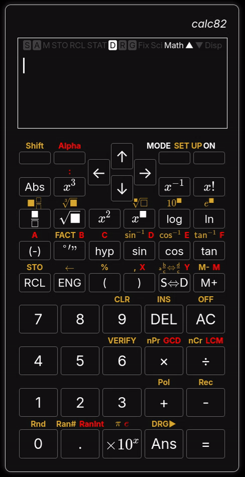
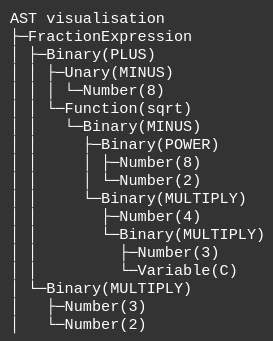

# calc82: because calculators are for everyone.
A calculator web-app inspired by the Casio fx-82 series of scientific calculators. Try it here: [placeholderlink]

    

## Quick start
Go to [placeholderlink] and start calculating! For help, press the ? (Help) sidebar button.

## Key features
- Familiar user interface
- Algebraic input
- Supports 15 significant figures of precision between 1e-100 to 1e100
- Supports trigonometry, combinatorics, logarithmics and other complex functions
- Memory persists between browser sessions
- Works fully offline

## How it works
At its core, calc82 uses a **recursive descent parser** to transform a string of input tokens into an **abstract syntax tree**. This allows correct operator precedence to be used. The tokens and AST visualisation can be seen under the settings tab by pressing 'toggle debug'.

## Building
Install esbuild. Example (for Debian-based systems):
`sudo apt install esbuild`

In the `src/` directory, run `esbuild app.js --bundle --outfile=app.bundle.js`

Host the application from the `src/` directory. Example: `python3 -m http.server`

### Third-party dependencies
This project makes use of **decimal.js** and **KaTeX** libraries. These dependencies are directly included under `lib/src`.

**decimal.js**\
Version: v10.6.0 (Modified for calc82)\
License: MIT\
Source: https://www.npmjs.com/package/decimal.js/v/10.6.0

**KaTeX**\
Version: 0.17.0 (Extra fonts removed)\
License: MIT\
Source: https://www.npmjs.com/package/katex/v/0.17.0

## Contributing
calc82 is beta software. It might contain bugs! If you find a bug, or want to make an improvement, please raise an issue or make a pull request.

## Legal
<small>
calc82 is an open-source software project licensed under the GNU General Public License, version 3 (GPLv3). See the accompanying license file for the full license terms.

calc82 was independently developed and was inspired by the Casio fx-82 series of scientific calculators. calc82 is not affiliated with, sponsored by, authorized by, or endorsed by Casio Computer Co., Ltd. “Casio” and related trademarks are the property of their respective owners.

calc82 is currently beta software and is provided for educational and informational purposes. It may contain errors, inaccuracies, or other defects, and its results are not guaranteed to be correct or complete.

**Do not rely on calc82 for critical, safety-related, financial, medical, engineering, or other applications where incorrect results could cause harm, loss, or damage.**

To the maximum extent permitted by applicable law, calc82 is provided “as is” and without warranties of any kind. The authors and contributors are not responsible for losses or damages arising from the use of, or reliance upon, the software or its results, except where such limitation is not permitted by law.
</small>
